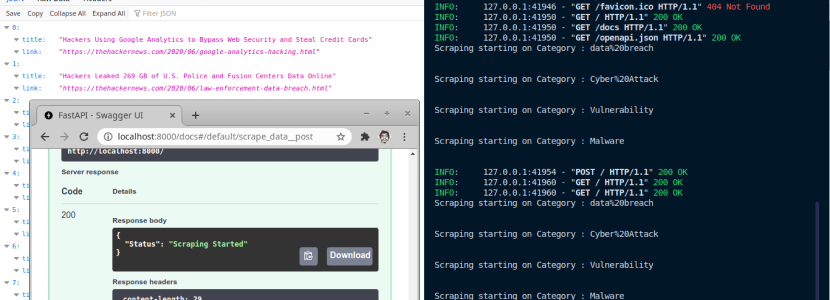

# THN_scraper_api

> A simple python script that goes to all four category pages in thehackernews.com and grabs all the latest articles and serves a json api for activating the scraping and to get all the scraped data.

---

## Accessing the API

> https://thn-scraper.herokuapp.com/api/v1/

* https://thn-scraper.herokuapp.com/api/v1/news

* https://thn-scraper.herokuapp.com/api/v1/category

* https://thn-scraper.herokuapp.com/api/v1/{category}/news

* https://thn-scraper.herokuapp.com/api/v1/{category}/news/{id}

## Usage

> Clone the repo

`$ git clone https://github.com/VishnuDileesh/THN_scraper_api`

> Change to the cloned repo

`$ cd THN_scraper_api`

>  Install the necessary packages

`$ pip3 install -r requirements.txt`

> Running the project

`$ python3 run.py`

